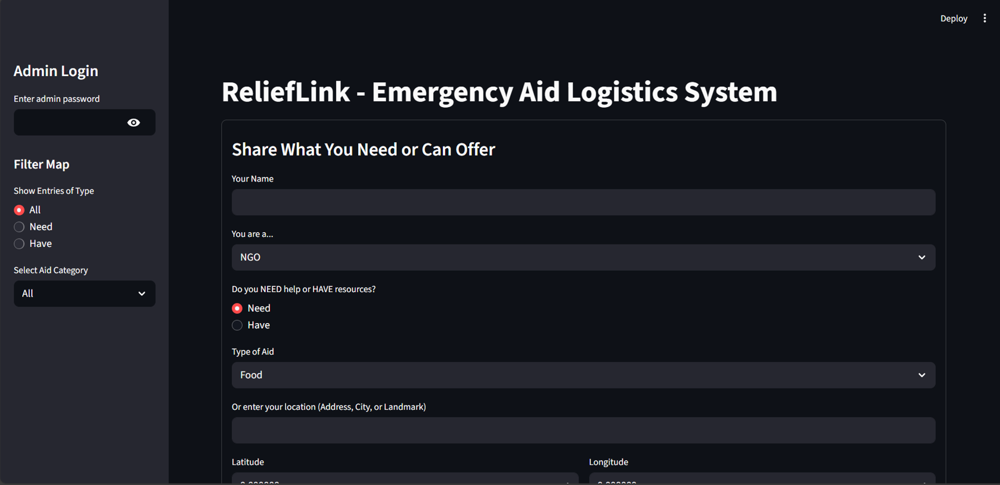
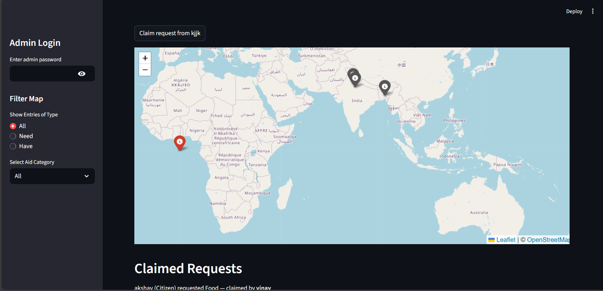
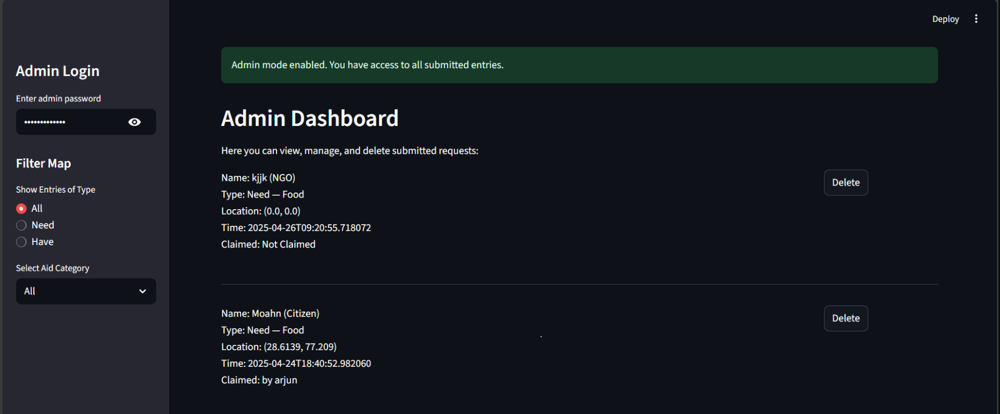
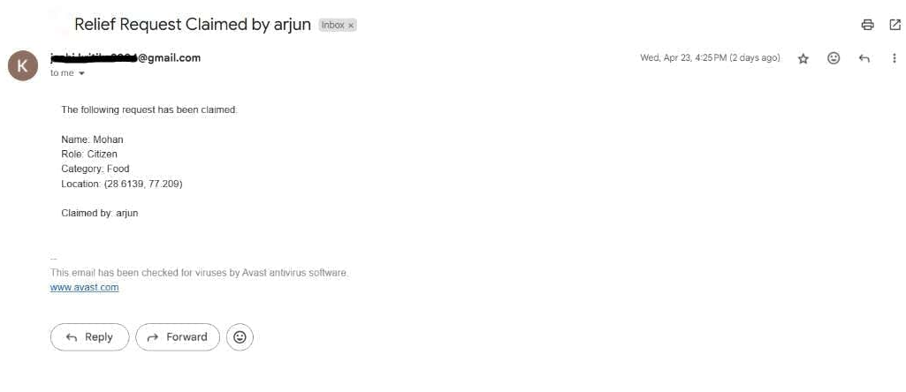

##  ReliefLink
A real-time emergency logistics coordination system to streamline crisis aid distribution with visibility, transparency, and simplicity.

LIVE LINK = https://hackathonproject-5jqxa7ddytybn4klaud8sw.streamlit.app/

##  Problem Statement
Problem Statement – Redesign Crisis Logistics and Relief Distribution
Build a digital logistics system to help NGOs and governments coordinate emergency aid, track supply chains, needs, drop zones, and distribution transparency in real-time during crises.

##  Objective
In times of disaster, coordinating aid is often chaotic — requests go unanswered, resources are misallocated, and visibility is lost.
ReliefLink solves this by creating a centralized, real-time digital platform where field volunteers, NGOs, and authorities can:

* Post and track aid requests
* Claim and fulfill needs transparently
* Monitor relief operations with complete accountability
* It ensures quick, accurate aid delivery, empowering both the providers and the recipients during emergencies.

---

 

### My Approach:
* Chose this problem due to its real-world humanitarian impact
* Focused on real-time visibility, minimal friction for field users, and robust coordination features
* Pivots included replacing auto-location with address-based geocoding for greater accuracy in low-connectivity zones
* Implemented features focused on transparency and operational resilience

##  Tech Stack
Core Technologies Used:
* Frontend: Streamlit (for rapid UI development and simplicity on field devices)
* Backend: Python (Streamlit integrated logic)
* Database: Firebase Realtime Database

APIs:
* Nominatim API (for geocoding address to lat/lon)
* SMTP (for email notifications)

##  Key Features
* Real-time Relief Request System – Submit and view emergency aid requests instantly 
* Volunteer Claim System – Volunteers can claim requests with their name, increasing transparency 
*  Email Notifications – Sends auto-email to requesters when their request is claimed 
*  Smart Filtering & Search – Filter requests by category, location, and urgency 
*  Firebase Realtime Sync – Ensures all users see the latest data without refresh 
*  Admin Dashboard – Manage requests, delete entries, and monitor the entire relief operation 

##  How to Run the Project
Requirements:
* Python 3.x
* Firebase project setup (Realtime DB)
* API Key for Nominatim (if hitting rate limits)

## Setup Instructions:
## Clone the repo
git clone https://github.com/Kjoshi04/hackathon_project

## Navigate to project
cd hackathon_project

## Install Streamlit
pip install streamlit firebase-admin requests

## Run the app
streamlit run app.py 
Make sure you configure Firebase credentials and optionally an .env file for sensitive keys.

##  Future Scope
*  Map Integration to visualize aid locations 
*  Role-based access for better data control (volunteer/admin/government) 
*  Offline mode using PWA or caching for field use in low-connectivity zones 
*  Mobile version for on-the-go access 
*  Push notifications for real-time claim and delivery updates 

##  Resources 
* OpenStreetMap Nominatim API
* Streamlit Docs
* Firebase Documentation
* SMTP & Python Email Tutorial

